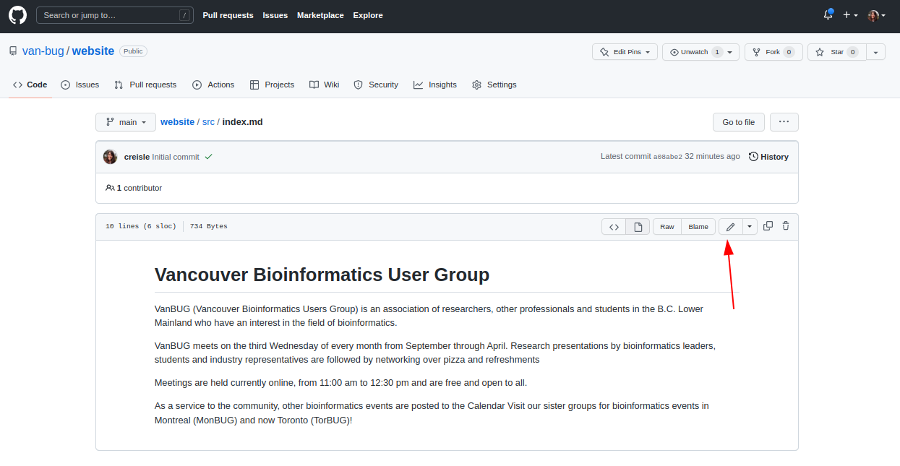

# VanBUG Website

This repository contains the source code which builds the VanBUG website. The contents of the site are written in Markdown and are processed into a static site using python and mkdocs. All changes must be done through a pull-request to the main branch so that they can be approved by the other members. Once merged into the main branch the site will automatically build and re-deploy using github actions.

## Getting Started

As a developer working on the website you will need to have python3.10 installed. This repository uses poetry to manage package dependencies. If you can, then install poetry globally, otherwise you can use a virtual environment which poetry will re-use during install.

```bash
poetry install
```

To render the docs and re-render on changes you can start the development server as follows

```bash
poetry run mkdocs serve
```

Your build docs should now be available on localhost:8000

## Making Small Changes

If you need to simply make a small change to one of the markdown files that can be done directly in GitHub by navigating to the page



## Useful Tools

When editing the markdown docs I reccommend using vscode and installing a few helpful markdown extensions. These extensions will do helpful things like auto-formatting lists, auto-adding table of contents etc. The liting will also help you see when you have made any style errors in your markdown file

- markdownlint ([DavidAnson.vscode-markdownlint](https://marketplace.visualstudio.com/items?itemName=DavidAnson.vscode-markdownlint))
- Markdown All in One ([yzhang.markdown-all-in-one](https://marketplace.visualstudio.com/items?itemName=yzhang.markdown-all-in-one))

After you have added the extensions, put the following line in your settings.json (or using the GUI version) for vscode

```json
    "markdown.extension.toc.levels": "2..4",
```
