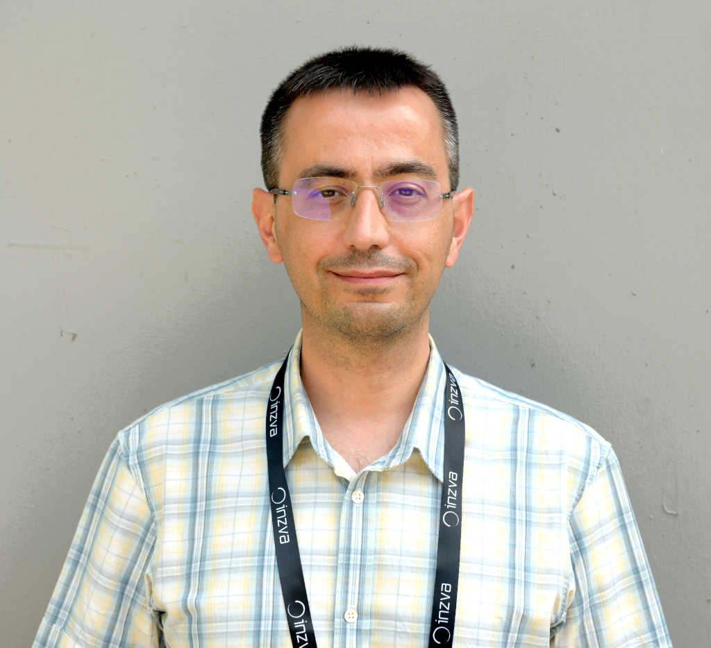
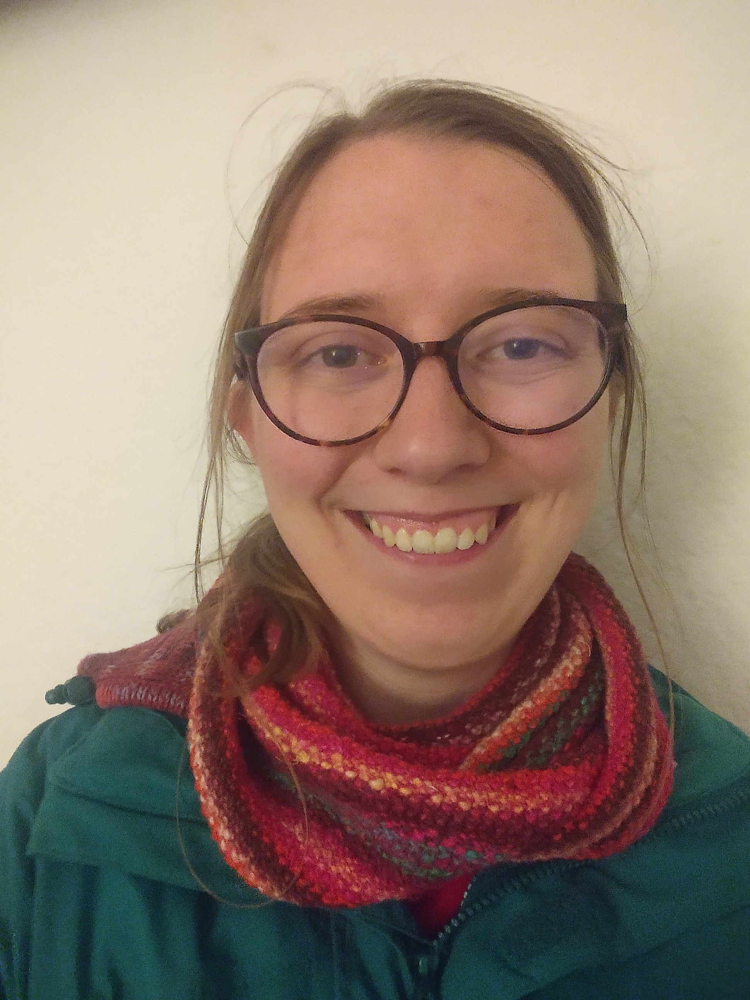

# Nov - Can Alkan

!!! info "Event Details"

    **Date/Time:**

    Thursday, November 21st, 2024 :material-clock: 11:00am - 12:30pm PT

    **Location:**

    :material-video: Remote

/// html | div[class="bio"]

/// html | div

**Featured Speaker**: Can Alkan

**Talk Title:** Acceleration of bioinformatics workloads through hardware/algorithm co-design

**Affiliation:**

- Associate Professor, Department of Computer Engineering, Bilkent University
- Associate Editor, Bioinformatics

///

///

**Bio:**

Can Alkan is an Associate Professor at the Department of Computer Engineering at Bilkent University. His research interests include computational prediction of human genomic structural variation, and characterization of segmental duplications and copy-number polymorphisms using high throughput sequencing data, and acceleration of genome analysis through hardware/software co-development. He also serves as an Associate Editor for the Bioinformatics journal, a Steering Committee Member for the RECOMB-Seq Conference, an Organization Committee Member for the HiTSeq Conference, an Editorial Board Member for the Genome Research journal, and the Organization Committee Co-Chair of the RECOMB 2023 Conference held in İstanbul.

**Abstract:**

Genome sequence analysis can enable significant advancements in areas such as personalized medicine, study of evolution, and forensics. However, effectively leveraging genome sequencing for advanced scientific and medical breakthroughs requires very high computational power. As prior works have shown, many of the core steps in genome sequence analysis are bottlenecked by the current capabilities of computer systems, as these steps must process a large amount of data.

This talk describes our ongoing journey in improving the performance of genome read mapping through hardware/software co-design. I will first introduce using paralellism in existing hardware such as single instruction multiple data (SIMD) instructions in commodity CPUs, and then describe use of massively parallel GPGPUs. I will then introduce our FPGA designs for the same purpose. Finally, I will discuss our latest acceleration efforts to map both short and long reads using the emerging processing-in-memory computation.

---

/// html | div[class="bio"]

/// html | div

**Trainee Speaker:** Madeline Iseminger

**Affiliation:** MSc student, Hsiao Lab, The Centre for Infectious Disease Genomics and One Health, SFU

**Talk Title**: An ontology-based approach for tracking viral mutation impacts

///

///
