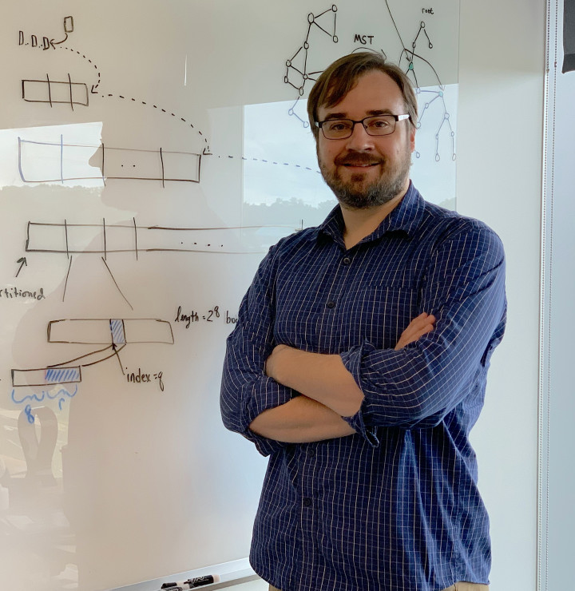

# Feb - Rob Patro

!!! info "Event Details"

    **Date/Time:**

    Thursday, February 20th, 2025 :material-clock: 11:00am - 12:30pm PT

    **Location:**

    :material-video: Remote

/// html | div[class="bio"]

/// html | div

**Featured Speaker**: Dr. Rob Patro

**Talk Title:**  The Matrix Has You : The Importance of Accurate, Efficient and Open Methods Upstream of Single-Cell Count Matrices

<!--  -->

**Affiliation:**

- Associate Professor, University of Maryland & Co-founder/CTO, Ocean Genomics Inc.

///

///

**Bio:**

Rob Patro is an associate professor of Computer Science at the University of Maryland, and a member of the University of Maryland Institute for Advanced Computer Studies (UMIACS) and the Center for Bioinformatics and Computational Biology (CBCB). His main research interests are in the design of algorithms and data structures for processing, organizing, indexing and querying high-throughput genomics data and in the intersection between efficient algorithms and statistical inference. A current research focus of his lab is the development of computational methods for accurate, efficient and uncertainty-aware transcriptome analysis using RNA-seq (both bulk and single-cell with both long and short reads) as well as on the design of scalable (often succinct) data structures for indexing and querying genomes and raw sequencing data. He is a core developer and maintainer of the salmon, alevin, alevin-fry and simpleaf software tools, and his lab develops a number of open-source tools for high-throughput genomic and transcriptomic analysis, most of which are available from GitHub at [https://github.com/COMBINE-lab](https://github.com/COMBINE-lab).

**Abstract:**

Many researchers working in single-cell biology and bioinformatics consider a count matrix (e.g. a gene-by-cell count matrix for single-cell RNA-seq or peak-by-cell count matrix for single-cell ATAC-seq) to be the starting point of their analysis. Yet, the preprocessing methods that generate these matrices from raw sequencing data must solve several difficult challenges, and differences in the underlying assumptions and computational procedures can result in impactful and meaningful changes in downstream analysis. I will describe some of the challenges that face single-cell preprocessing methods, and will describe alevin-fry and alevin-fry-atac, efficient open-source methods for preprocessing of single-cell data that we have developed in our lab. I will argue for the importance of accurate, efficient, and fully open-source methods in building single-cell processing pipelines. Finally, I will describe the simpleaf framework, which is designed to simplify raw-data processing, to codify best practices, and to enhance computational reproducibility and provenance tracking.

---

/// html | div[class="bio"]

/// html | div

**Trainee Speaker:** Parham Kazemi

**Affiliation:** PhD candidate, Birol Lab, The University of British Columbia

**Talk Title**: Modelling k-mer profiles of sequencing data with evolutionary algorithms

///

///
