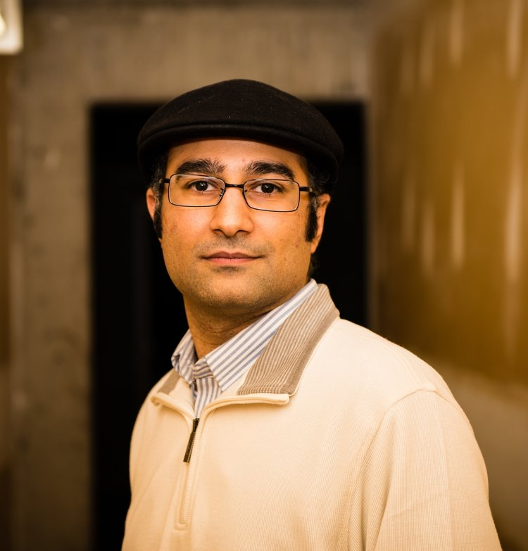
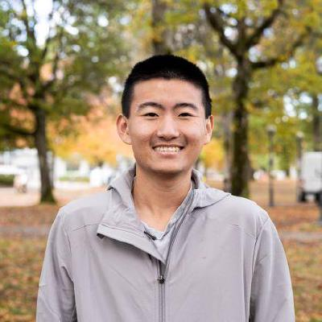

# Mar - Fereydoun Hormozdiari

!!! info "Event Details"

    **Date/Time:**

    Thursday, March 13th, 2025 :material-clock: 11:00am - 12:30pm PT

    **Location:**

    :material-video: Remote

/// html | div[class="bio"]

/// html | div

**Featured Speaker**: Dr. Fereydoun Hormozdiari

**Talk Title:**  Computational and machine learning approaches in studying genomics and complex diseases

<!--  -->

**Affiliation:**

- Associate Professor at the University of California, Davis

///

///

**Bio:**

Fereydoun Hormozdiari is an Associate Professor at the University of California, Davis (UC Davis). His research expertise lies in bioinformatics and computational biology, with a focus on the human genome and complex diseases such as autism and cancer. Dr. Hormozdiari has received prestigious awards such as Solan Research and the NSF CAREER Award for his research in computational genomics. His current research focuses on developing advanced computational algorithms for genomics, applying machine learning techniques to investigate human health and disease, and exploring the molecular mechanisms of cancer biology.

**Abstract:**

In this talk, we will introduce a novel computational concept of sample-specific (SFS) strings for processing long-read genomic data. We will present advanced methods that utilize SFS strings to identify structural variants in hard-to-call genomic regions and augment pangenome graphs. We will also explore how non-coding SVs contribute to complex diseases. Finally, we will discuss innovative computational approaches for studying non-coding regions, such as enhancers, and their role in cancer development.

---

/// html | div[class="bio"]

/// html | div

**Trainee Speaker:** Chunqing (Tony) Liang

**Affiliation:** MSc Bioinformatics, UBC under Dr. Amrit Singh, CompBio lab of Centre for Heart Lung Innovation at St Paul's hospital

**Talk Title**: MESSI: A Nextflow pipeline for benchmarking multiomics integration methods

///

///
