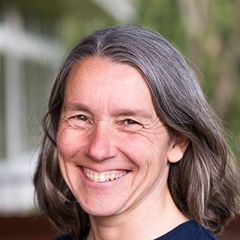
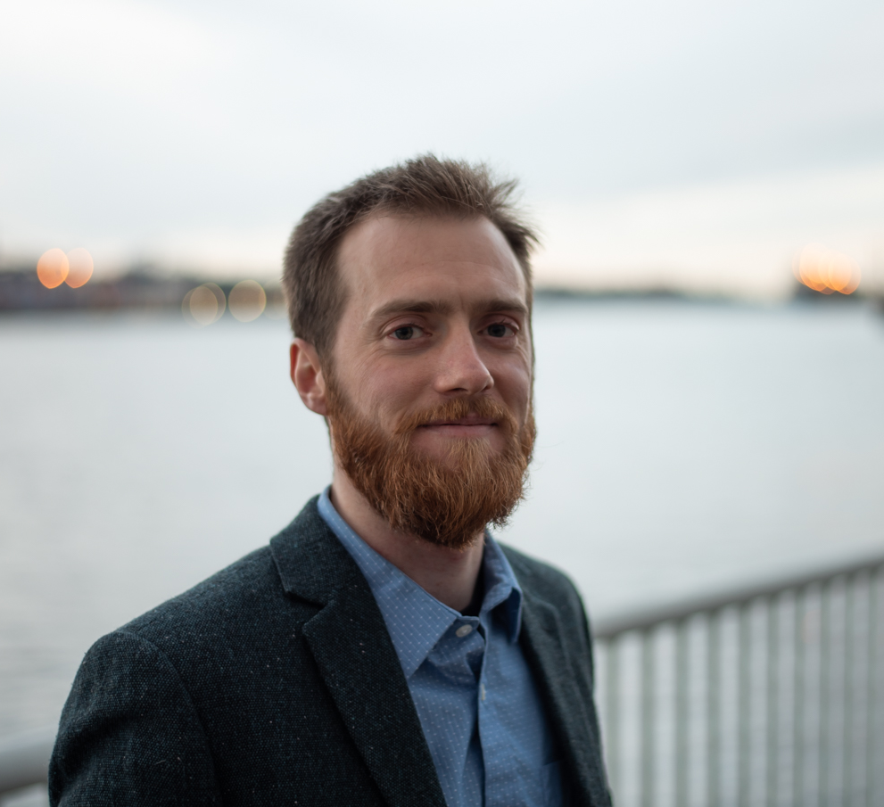

# Sep - Anne Condon

!!! info "Event Details"

    **Date/Time:**

    Thursday, February 19th, 2026 :material-clock: 6:00pm - 8:00pm

    **Location:**

    :material-map-marker: **Location:** Vancouver General Hospital, Jimmy Pattison Pavilion South ([899 West 12th Ave., Vancouver, BC V5Z 1M9](https://maps.app.goo.gl/pvM16Frig5VjA9e69)), 1891 Lecture Theatre

/// html | div[class="bio"]

/// html | div

**Featured Speaker**: Dr. Anne Condon

**Talk Title:**  Some how’s and why’s of computing with DNA molecules

<!----->

**Affiliation:**

Professor, Computer Science, The University of British Columbia

///

///

**Bio:**

Anne Condon is a Professor in Computer Science at UBC, where she has served as Department Head and Associate Dean in the Faculty of Science. Trained as a computer science theoretician, her current research interests are in biomolecular computation and computational prediction of RNA and DNA reaction kinetics.

Anne received her Bachelor's degree in Computer Science and Mathematics from University College Cork, Ireland (1982), and her Ph.D. in Computer Science at the University of Washington (1987).

She is an ACM Fellow, a Fellow of the Royal Society of Canada, and recipient of the Computing Research Association's Habermann Award for her work on increasing the numbers and successes of women in computing research.

**Abstract:**

Principles of computing transcend silicon-based technologies. DNA and other biomolecules compactly store information, and nature has provided an incredible toolbox for processing this information in a test tube or a cell. How might we “compute” with biomolecules in innovative, robust, and efficient ways not found in nature? What might such
computations be useful for? Computational models of bio-computation at different levels of abstraction are helpful in tackling these questions and in guiding wet-lab DNA computations.

In this overview talk we’ll describe such models, ranging from chemical reaction networks as a high-level programming language, to stochastic models of DNA kinetics that aim to predict how DNA strands fold, interact, and “compute” in a test tube. 

We’ll also touch on what makes the highly interdisciplinary field of bio-molecular computation intellectually stimulating and very fun to work in, despite, or perhaps because of, the lack of clear answers yet to the second question above.

---

/// html | div[class="bio"]

/// html | div

**Trainee Speaker:** Maxwell Douglas

**Affiliation:** Ph.D. student in Bioinformatics, Park Lab, UBC & BC Cancer Research Centre

**Talk Title**: Hunting for mediation in expression quantitative trait loci: a case-study using ovarian cancer

///

///
