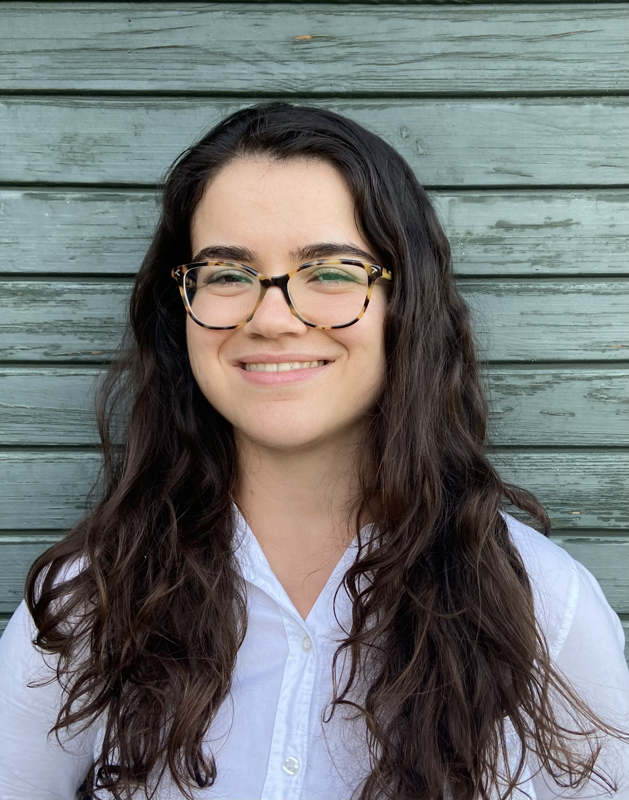

# Oct - Emilia Lim

!!! info "Event Details"

    **Date/Time:**

    Thursday, October 22nd, 2026 :material-clock: 6:00pm - 8:00pm

    **Location:**

    :material-map-marker: **Location:** Gordon and Leslie Diamond Health Care Centre ([2775 Laurel St, Vancouver, BC V5Z 1M9](https://maps.app.goo.gl/bvXxcRMzUaC2cQkG7)), 1020 Lecture Theatre

/// html | div[class="bio"]

/// html | div

**Featured Speaker**: Dr. Emilia Lim

**Talk Title:**  Mapping How Air Pollution Promotes Lung Cancer

**Affiliation:**

Assistant Professor in the Department of Biochemistry and Molecular Biology at the University of British Columbia and an Investigator at Edwin S.H. Leong Centre for Healthy Aging

///

///

**Bio:**

Emilia obtained her BSc in Bioinformatics at the University of Alberta, where she completed her thesis on the Human Metabolome Project with Dr. David Wishart. She then pursued her PhD in Bioinformatics under the mentorship of Dr. Marco Marra at UBC and the BC Cancer Genome Sciences Centre. She worked on epigenomic and transcriptomic biomarker discovery for treatment refractory hematological and pediatric cancers through the TCGA and TARGET NCI initiatives. She then completed her postdoctoral training with Dr. Charles Swanton at the Francis Crick Research Institute and University College London (UCL). She worked on the TRACERx and PEACE studies, examining chromosomal instability and how it shapes lung cancer evolution. Her interest in lung cancer in never smokers directed her to develop a framework for studying the environmental impact on cancer initiation. She discovered that air pollution triggers lung cancer initiation by promoting clonal expansion of cells harbouring oncogenic mutations which have accumulated due to aging. Her current research program concerns how environmental pollutants disrupt normal cells to accelerate the initiation of age-related disease states such as cancer.

**Abstract:**

Lung cancer in never-smokers is rising, particularly among women and individuals of Asian descent, and is frequently driven by EGFR mutations despite unusually low overall mutational burden. This pattern is difficult to reconcile with the classical model of carcinogenesis, in which carcinogens directly induce DNA mutations that drive tumour growth. This talk presents converging evidence—from epidemiology, mouse models, controlled human pollution exposures, and studies of normal lung tissue—supporting an alternative "tumour promotion" model, in which pre-existing oncogenic mutations (the initiator) are activated by air pollution exposure (the promoter) rather than being caused by it.

Fine particulate matter (PM2.5) exposure is shown to drive IL1B-mediated inflammation and macrophage activation, expand the progenitor-cell capacity of EGFR-mutant lung cells, and promote clonal outgrowth of latent mutant clones already present in normal aging lung tissue. Clinical trial data (CANTOS) suggest this pathway may be therapeutically targetable.

To directly visualize how pollution injures lung tissue, spatial transcriptomics is used to map gene expression across normal lung tissue in relation to anthracotic pigment—a histological marker of accumulated air pollution exposure. By comparing regions of interest overlapping anthracotic pigment to unaffected regions within the same tissue, this approach reveals localized shifts in epithelial cell composition, upregulation of oncogenic and inflammatory gene programs, suppression of lysosome/phagosome pathways, and impaired antiviral signalling specifically within "injured," pollution-exposed areas of the lung. A high-throughput image analysis workflow (SHADE) further enables systematic quantification of anthracosis across large tissue cohorts, linking pigment burden to an aggressive micropapillary-predominant lung cancer subtype.

Together, these findings support a model in which air pollution promotes lung carcinogenesis primarily through localized, chronic inflammation acting on pre-existing mutations, rather than through new mutagenesis—reframing how environmental carcinogens should be studied and targeted for prevention.

---

/// html | div[class="bio"]

/// html | div

**Trainee Speaker:** Asli Munzur

**Affiliation:** PhD student in Genome Sciences and Technology, Wyatt Lab, UBC & Vancouver Prostate Centre

**Talk Title**: TBD
