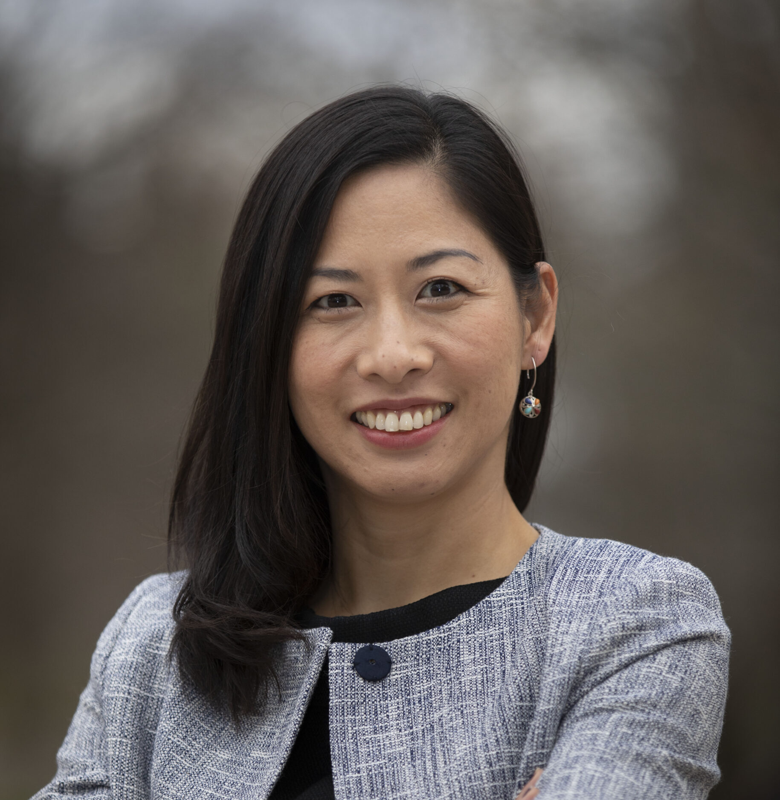

# Nov - Maria Tokuyama

!!! info "Event Details"

    **Date/Time:**

    Thursday, September 17th, 2026 :material-clock: 6:00pm - 8:00pm

    **Location:**

    :material-map-marker: **Location:** Vancouver General Hospital, Jimmy Pattison Pavilion South ([899 West 12th Ave., Vancouver, BC V5Z 1M9](https://maps.app.goo.gl/pvM16Frig5VjA9e69)), 1891 Lecture Theatre

/// html | div[class="bio"]

/// html | div

**Featured Speaker**: Dr. Maria Tokuyama

**Talk Title:**  TBD

**Affiliation:**

- Assistant Professor in the Department of Microbiology & Immunology at The University of British Columbia

///

///

**Bio:**

Dr. Tokuyama has always been interested in the interaction between viruses and the immune system. As an undergrad at University of California, Irvine, she worked in an infectious disease lab that focused on HIV research and obtained her B.S. in Molecular Biology and Biochemistry. She then worked at the National Institutes of Health at the Vaccine Research Center studying Ebola virus vaccines. Dr. Tokuyama obtained her Ph.D. in Molecular and Cellular Biology from University of California, Berkeley where she studied mechanisms of how natural kill cells recognize and kill cell infected by herpesviruses. Dr. Tokuyama trained at Yale University in the Department of Immunobiology, where she became fascinated by endogenous retroviruses and established the foundation for the research that she will carry out at UBC. In the past year, Dr. Tokuyama has also been part of the Yale IMPACT Team to develop a rapid saliva-based qPCR assay for SARS-CoV-2 and contributing to research on understanding immunological impacts of COVID-19.

**Abstract:**

TBD

---

/// html | div[class="bio"]

/// html | div

**Trainee Speaker:** Moritz Aubermann

**Affiliation:** MSc student in Bioinformatics, Pavlidis Lab, UBC

**Talk Title**: Semantically Informed Embeddings of Differential Expression Data

///

///
