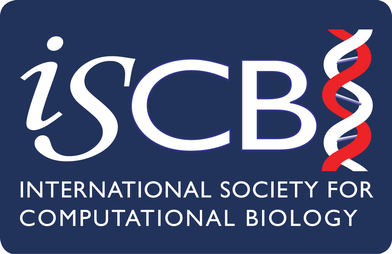
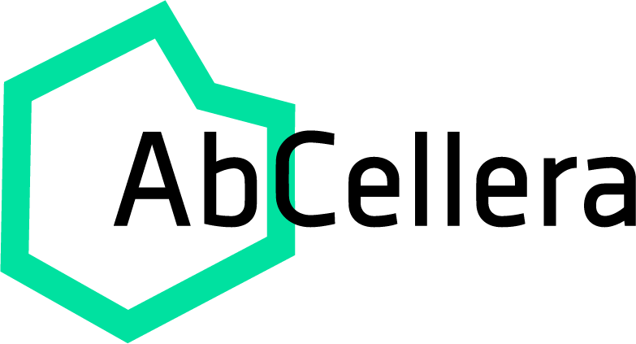

# Sponsorship

VanBUG is a non-profit that is possible through the work of volunteers, however we welcome support in order to bring in outside speakers and host other significant events.

If you are interested in sponsoring our events (a single event, a term, or a year), please [contact us](https://www.vanbug.org/contact/).

VanBUG welcomes bioinformatics-related companies to present short (maximum 10 minutes) presentations before VanBUG meetings. Please [contact us](https://www.vanbug.org/contact/) for more details.

## Current Sponsors

VanBUG is an Affiliate Partner of the Canadian Bioinformatics Hub and is supported by the following organizations:

/// html | div[class="image-gallery"]

- 
- 
- 
- 
- 
- 
- 

///

## Affiliations

/// html | div[class="image-gallery"]

- [{ data-dark="./images/iscb.logo.dark.png" }](http://www.iscb.org)
- 
- 
- 
- 

///

## Previous sponsors

We have previously been provided generous support from:

/// html | div[class="image-gallery"]

- 
- 
- 
- 
- 
- 
- [{ data-dark="./images/ubc-dom.logo.dark.png" }](https://www.med.ubc.ca)
- 
- 

///
